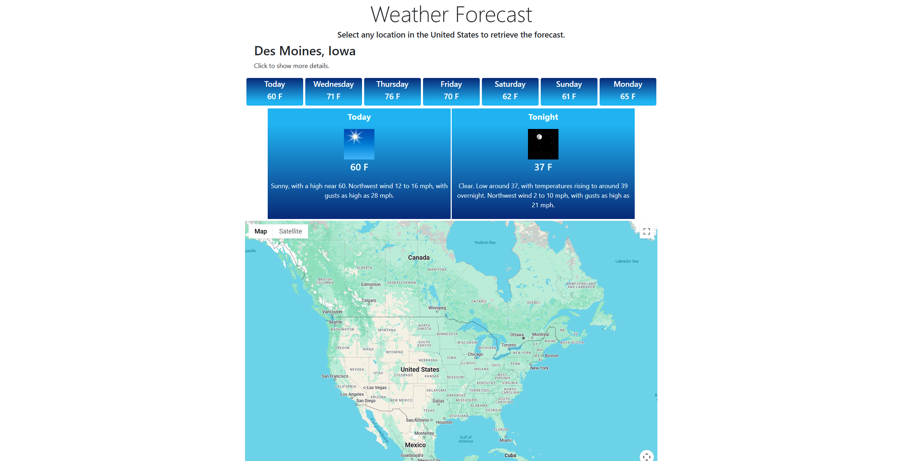
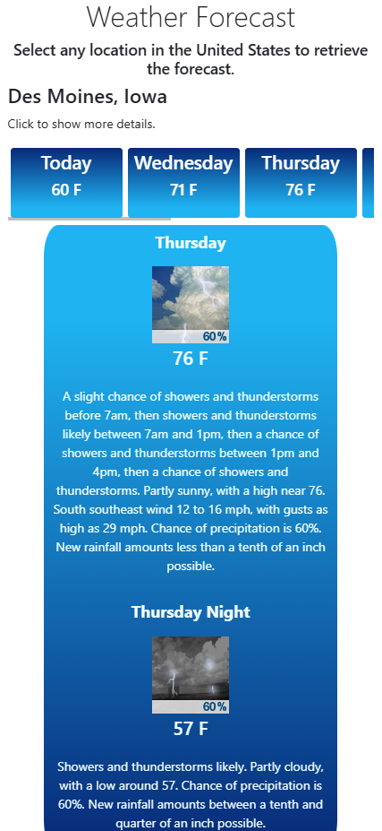

<h1>Location Forecasting</h1>
<h3>Overview</h3>

  Select any location in the United States using google maps and receive the city, state, and the week's forecast.

  <h3>How it Works</h3>

  <h4>Getting the Location</h4>
  

    The user clicks a location on the map, in the background, the map grabs the latitude and longitude of the placed mark. 
    I then call the Google Maps API and pass in the latitude and longitude. It returns with lots of information regarding that position so I only grab the City and State name.
  

  <h4>Getting the Weather Forecast</h4>
  

    Once again, I use the latitude and longitude to send to National Weather Service API which then returns the grid that contains the latitude longitude position. 
    With that grid, a forecast url is also returned which contains the weather forecast of that region.
  

  <h4>Database Functionality</h4>
  

    I use a database to store weather request logs, exception logs, and some system settings.
    The request logs table shows a big data payload of all the information returned from the API as well as the time of the log.
    The exception logs shows the exception message, stack trace, and the time of the exception.
  

  
  

